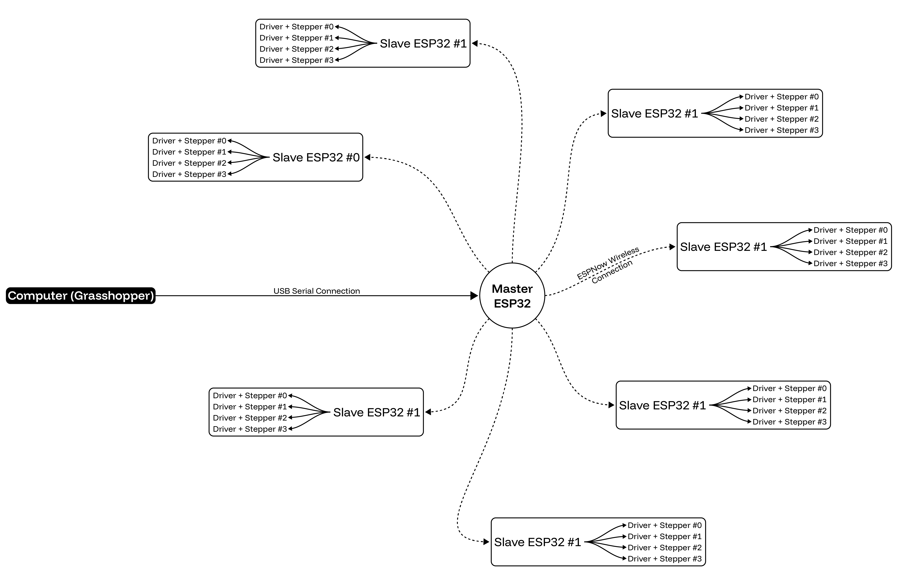

# ESP-NOW_GH
###### A real-time Grasshopper ↔ ESP32 communication workflow using ESP-NOW. Enables simultaneous read/write control of ESP32 swarms with near-zero latency, providing a scalable, Firefly-free alternative for building fully integrated computational design and interactive systems.


## Overview

This project presents a real-time communication workflow between **Grasshopper ↔ ESP32(Master) ↔ ESP32(Slaves)** using the **ESP-NOW** protocol. By streaming data directly into the Grasshopper interface, the workflow allows complete computational pipelines to be constructed around **sensing, actuation, multi-agent coordination, and distributed intelligence**.

With **Firefly deprecated** and constrained by serial-based communication, this approach leverages ESP-NOW to overcome limitations related to latency, scalability, and system architecture. It supports **swarm-based control**, real-time feedback loops, and peer-to-peer communication without relying on traditional Wi-Fi networking or point-to-point serial connections.

### Prerequisite

The Grasshopper integration is **based on the plugin [SuperSerial](https://www.food4rhino.com/en/app/superserial)** by **Fabio D'Agnano**, which is used here as a flexible serial bridge between Grasshopper and the Master ESP32.

Further documentation on SuperSerial is available [here](https://www.masterad.it/superserial-grasshopper-plugin/).

### Features

* Near-zero latency communication
* Simultaneous read/write to multiple ESP32s
* Scalable swarm architecture
* Real-time data streaming in Grasshopper
* ESP-NOW based (no router required)
* Suitable for interactive systems and cyber-physical workflows


# **1. Basic Interactions — Serial ↔ Grasshopper Workflows**

Before introducing ESP-NOW, this repository documents a set of **serial-based interaction workflows** between **ESP32 and Grasshopper**, using the **SuperSerial plugin**. These examples demonstrate the Reader/Writer architecture that later becomes the foundation for wireless ESP-NOW workflows.


## **1.0 Architecture — Reader/Writer Logic**

Communication is established through a **serial-based feedback loop** inside Grasshopper using **SuperSerial** as the bridge to the ESP32.

```
ESP32 → SuperSerial (Receive) → GH Workflow → writer.py → Temp Folder → reader.py → SuperSerial (Send) → ESP32
```

The ESP32 sends sensor data **directly to SuperSerial**, which makes it available inside Grasshopper for real-time computation.
After processing, the output is written to a temporary folder via **writer.py**, picked back up by **reader.py**, and returned to SuperSerial for transmission back to the ESP32.

This structure allows Grasshopper to bypass data looping limitation and function as:

✔ A live sensor data visualizer

✔ A real-time controller for actuators

✔ A computational processing layer between input and output

> **Inside this loop, we can build any computational workflow we want — enabling real-time I/O interaction for robotics, kinetic systems, and IoT prototyping.**
> The following examples illustrate this through LDR, ultrasonic, and joystick control setups.

**Files involved:**

📄 [`Reader_Writer.gh`](https://github.com/cxlso/ESP-NOW_GH/raw/refs/heads/main/Grasshopper/Tools/Reader_Writer.gh) — Grasshopper definition

🐍 [`reader.py`](Python/Reader_Writer/reader.py) — Reads processed data from temp folder and feeds it to SuperSerial (included in GH definition)

🐍 [`writer.py`](Python/Reader_Writer/writer.py) — Writes computed values from Grasshopper out to temp folder (included in GH definition)


## **1.1 Serial I/O — Stepper + Photoresistor (LDR)**

Reads an analog LDR value → smooths input → sends value to Grasshopper.
Grasshopper remaps brightness to **stepper motor steps** and visualizes the value as a **circle + arrow indicator**.

📎 *Use with the sketch:* `Serial_IO_Stepper_Photoresistor.ino`
📄 *Grasshopper file:* `Serial_IO_Stepper_Photoresistor.gh`

**Workflow:**

| Sensor input           | Grasshopper output                         |
| ---------------------- | ------------------------------------------ |
| Raw LDR analog value   | Circle HUD displays brightness magnitude   |
| Light intensity change | Step count remapped from brightness        |
| Smoothed input filter  | Stepper motion becomes stable & responsive |

**Pin Used:**

| Pin          | Type           | Function                             |
| ------------ | -------------- | ------------------------------------ |
| `LDR_PIN 33` | Analog input   | Reads LDR brightness value           |
| `DIR 16`     | Digital output | Stepper motor direction              |
| `PUL 17`     | Digital output | Step pulse signal for stepper driver |

Useful for light-reactive kinetic systems and calibration experiments.

## **1.2 Serial I/O — Stepper + Ultrasonic Sensor**

Reads ultrasonic distance → filtered → sent to Grasshopper → GH maps distance to step count.
HUD display shows realtime distance feedback.

📎 *Sketch:* `Serial_IO_Stepper_Ultrasonic.ino`
📄 *Grasshopper:* `Serial_IO_Stepper_Ultrasonic.gh`

**Workflow:**

| Sensor input              | Grasshopper output                        |
| ------------------------- | ----------------------------------------- |
| Distance measurement (cm) | Live HUD distance display                 |
| Object approaching sensor | Stepper advances or reacts proportionally |
| Moving average filtering  | Smooth signal → accurate physical motion  |

**Pin Used:**

| Pin           | Type           | Function                            |
| ------------- | -------------- | ----------------------------------- |
| `TRIG_PIN 33` | Digital output | Sends ultrasonic trigger pulse      |
| `ECHO_PIN 32` | Digital input  | Receives echo to calculate distance |
| `DIR 16`      | Digital output | Stepper motor direction             |
| `PUL 17`      | Digital output | Step pulses for stepper driver      |

Ideal for proximity-based interaction, installation control, reactive surfaces.

## **1.3 Serial I/O — Stepper + Joystick**

Reads **X/Y joystick axes** → Grasshopper interprets 2D position inside a circle → sends angle/distance to stepper.

Two versions exist:

### **Basic**

* Reads X,Y analog values
* Displays HUD circular interface
* Maps magnitude or angle to step count

### **Advanced**

* Joystick movement direction controls rotation
* Circular gestures increment turns
* Essentially becomes a **manual rotational input device**

📎 *Sketch:* `Serial_IO_Stepper_Joystick.ino`
📄 *Grasshopper:* `Serial_IO_Stepper_Joystick.gh`
📄 *Grasshopper:* `Serial_IO_Stepper_Joystick_Advanced.gh`

**Workflow:**

| Sensor input                       | Grasshopper output                                 |
| ---------------------------------- | -------------------------------------------------- |
| X,Y analog joystick values         | 2D HUD position inside circle                      |
| Stick angle & distance from center | Mapped to step count or rotational direction       |
| Continuous circular movement       | Advanced mode counts rotations + directional turns |

**Pin Used:**

| Pin        | Type           | Function                 |
| ---------- | -------------- | ------------------------ |
| `JOY_X 33` | Analog input   | Horizontal joystick axis |
| `JOY_Y 32` | Analog input   | Vertical joystick axis   |
| `DIR 16`   | Digital output | Stepper direction        |
| `PUL 17`   | Digital output | Step pulses              |


These three examples establish the **core loop**, later expanded into **wireless ESP-NOW swarms**.


## Signal Flow



## ESP32 Firmware

### Transmitter Node (Master)

### Receiver Nodes (Slave)

### Note on ESP32-C3 / C6 / S2 / S3

The ESP32-C3 (and similarly C6, S2, and S3) differs from many Arduino boards in that **USB serial output is disabled by default**. The Arduino IDE must be explicitly configured to expose the **USB CDC serial port at boot**. Documented [here](https://docs.espressif.com/projects/arduino-esp32/en/latest/tutorials/cdc_dfu_flash.html#usb-cdc)

In the Arduino IDE:

- **Tools → USB CDC On Boot → `Enabled`**

You should now see the serial output from the board as expected.

In this project, the **Receiver node (Master)** acts as a gateway between ESP32 transmitter nodes (Slaves) and Grasshopper, so it **must have USB CDC enabled** to ensure Serial communication.

For **Transmitter nodes**, this setting is only required during development and debugging, as they do not rely on Serial monitoring once deployed and communicate exclusively via ESP-NOW.

**Recommendation:** However, leaving **USB CDC on Boot enabled** simplifies debugging across all nodes.

## Repository Structure

```
espnow-grasshopper-swarm/
├── grasshopper/      # Grasshopper definitions and examples
├── firmware/         # ESP32 firmware (nodes + gateway)
├── docs/             # Protocol and workflow documentation
├── examples/         # Example projects and use cases
└── media/            # Diagrams, screenshots, videos
```

## Applications

* Swarm robotics
* Interactive installations
* Distributed sensing and actuation
* Cyber-physical fabrication
* Architectural intelligence systems

## Contributing

Contributions and suggestions are welcome.
Please submit a pull request or open an issue to discuss improvements.

## License

[![CC BY-NC-SA 4.0][cc-by-nc-sa-shield]][cc-by-nc-sa]

This work is licensed under a [Creative Commons Attribution-NonCommercial-ShareAlike 4.0 International License][cc-by-nc-sa].

[![CC BY-NC-SA 4.0][cc-by-nc-sa-image]][cc-by-nc-sa]

## Acknowledgements

Special thanks to [Luigi Pacheco](https://luigipacheco.com/), director of the
[Interactive Machines Lab](https://www.instagram.com/imachineslab) at the
[School of Architecture of Florida Atlantic University](https://www.fau.edu/artsandletters/architecture/)
for lending me his RealSense Camera.


<!-- Shields and link definitions -->

[cc-by-nc-sa]: http://creativecommons.org/licenses/by-nc-sa/4.0/
[cc-by-nc-sa-image]: https://licensebuttons.net/l/by-nc-sa/4.0/88x31.png
[cc-by-nc-sa-shield]: https://img.shields.io/badge/License-CC%20BY--NC--SA%204.0-lightgrey.svg
