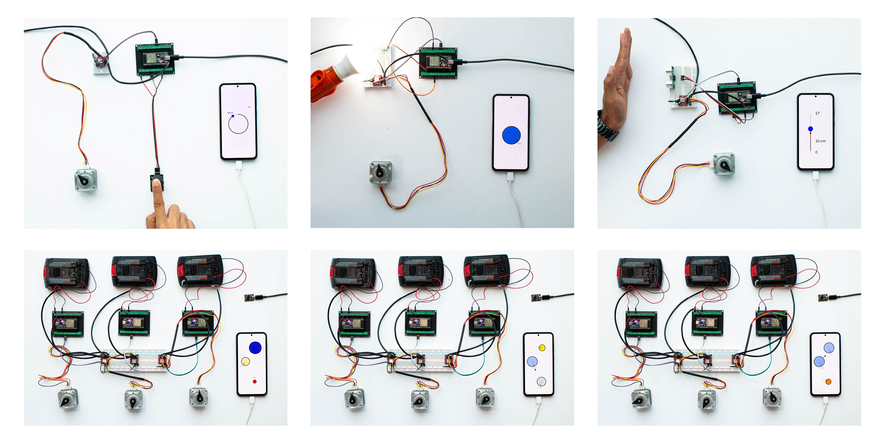
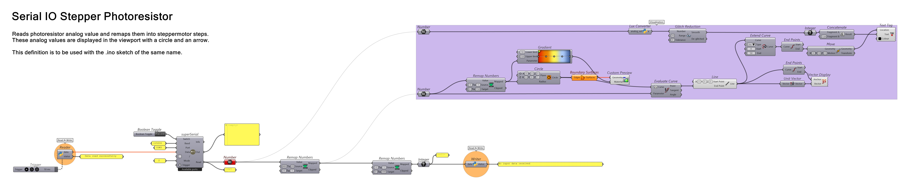
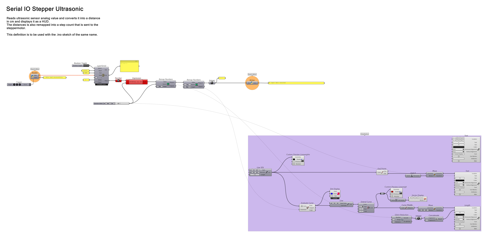
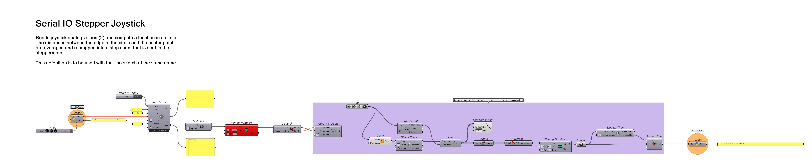
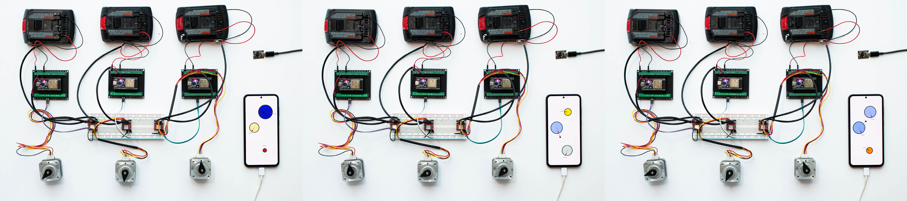

# ESP-NOW with Grasshopper
###### A real-time Grasshopper ↔ ESP32 communication pipeline for wired Serial & wireless ESP-NOW control. Enables continuous, near-zero latency, read/write workflows and scalable multi-device actuation without Firefly.



## Overview

This project establishes a real-time communication workflow using **two modes**:

1. **Grasshopper ↔ ESP32 (Serial full-duplex loop)**
   Used for sensor streaming, feedback, and computational control.
   Grasshopper reads incoming values through *SuperSerial*, processes them, and writes new outputs back to the ESP32 in real time.

2. **ESP32 (Master) ↔ ESP32 (Slaves) via ESP-NOW**
   Used for multi-motor wireless control.
   Target values computed in Grasshopper are sent to the Master over Serial, which then broadcasts them to Receiver nodes with minimal latency.

This combined system allows Grasshopper to function as the **central computation layer**, generating stepper motor targets from interactive geometry (e.g., attractors), while **ESP-NOW distributes commands wirelessly** across multiple devices.

Unlike Firefly-based Serial setups, this workflow supports **parallel wireless actuation, scalable swarms, and responsive kinetic control** without Wi-Fi routing or heavy latency.

### Prerequisite

The Grasshopper integration is **based on the plugin [SuperSerial](https://www.food4rhino.com/en/app/superserial)** by **Fabio D'Agnano**, which is used here as a flexible serial bridge between Grasshopper and the Master ESP32.

Further documentation on SuperSerial is available [here](https://www.masterad.it/superserial-grasshopper-plugin/).

### Features

* Near-zero latency communication
* Simultaneous read/write to multiple ESP32s
* Scalable swarm architecture
* Real-time data streaming in Grasshopper
* ESP-NOW based (no router required)
* Suitable for interactive systems and cyber-physical workflows


# 1. Basic Interactions — Serial ↔ Grasshopper Workflows

Before introducing ESP-NOW, this repository documents a set of **serial-based interaction workflows** between **ESP32 and Grasshopper**, using the **SuperSerial plugin**. These examples demonstrate the Reader/Writer architecture that later becomes the foundation for wireless ESP-NOW workflows.


## 1.1 Architecture — Reader/Writer Logic

Communication is established through a **serial-based feedback loop** inside Grasshopper using **SuperSerial** as the bridge to the ESP32.

```
ESP32 → SuperSerial (Receive) → GH Workflow → writer.py → Temp Folder → reader.py → SuperSerial (Send) → ESP32
```

The ESP32 sends sensor data **directly to SuperSerial**, which makes it available inside Grasshopper for real-time computation.
After processing, the output is written to a temporary folder via **writer.py**, picked back up by **reader.py**, and returned to SuperSerial for transmission back to the ESP32.

This structure allows Grasshopper to bypass data looping limitation and function as:

✔ A live sensor data visualizer

✔ A real-time controller for actuators

✔ A computational processing layer between input and output

> **Inside this loop, we can build any computational workflow we want — enabling real-time I/O interaction for robotics, kinetic systems, and IoT prototyping.**
> The following examples illustrate this through LDR, ultrasonic, and joystick control setups.

**Files involved:**

📄 [`Reader_Writer.gh`](https://github.com/cxlso/ESP-NOW_GH/raw/refs/heads/main/Grasshopper/Tools/Reader_Writer.gh) — Grasshopper definition

🐍 [`reader.py`](Python/Reader_Writer/reader.py) — Reads processed data from temp folder and feeds it to SuperSerial (included in GH definition)

🐍 [`writer.py`](Python/Reader_Writer/writer.py) — Writes computed values from Grasshopper out to temp folder (included in GH definition)

<div align="center">
  
</div>

## 1.2 Serial I/O — Stepper + Photoresistor (LDR)

Reads an analog LDR value → smooths input → sends value to Grasshopper.
Grasshopper remaps brightness to **stepper motor steps** and visualizes the value as a **circle + arrow indicator**.

<div align="center">
  
</div>


📎 *Use with the sketch:* [`Serial_IO_Stepper_Photoresistor.ino`](ESP32/Basic_Interactions/Serial_IO_Stepper_Photoresistor)

📄 *Grasshopper file:* [`Serial_IO_Stepper_Photoresistor.gh`](https://github.com/cxlso/ESP-NOW_GH/raw/refs/heads/main/Grasshopper/Basic_Interactions/Serial_IO_Stepper_Photoresistor.gh)

**Workflow:**

| Sensor input           | Grasshopper output                         |
| ---------------------- | ------------------------------------------ |
| Raw LDR analog value   | Circle HUD displays brightness magnitude   |
| Light intensity change | Step count remapped from brightness        |
| Smoothed input filter  | Stepper motion becomes stable & responsive |

**Pin Used:**

| Pin          | Type           | Function                             |
| ------------ | -------------- | ------------------------------------ |
| `LDR_PIN 33` | Analog input   | Reads LDR brightness value           |
| `DIR 16`     | Digital output | Stepper motor direction              |
| `PUL 17`     | Digital output | Step pulse signal for stepper driver |



Useful for light-reactive kinetic systems and calibration experiments.

## 1.3 Serial I/O — Stepper + Ultrasonic Sensor

Reads ultrasonic distance → filtered → sent to Grasshopper → GH maps distance to step count.
HUD display shows realtime distance feedback.

<div align="center">
  
</div>

📎 *Sketch:* [`Serial_IO_Stepper_Ultrasonic.ino`](ESP32/Basic_Interactions/Serial_IO_Stepper_Ultrasonic)

📄 *Grasshopper:* [`Serial_IO_Stepper_Ultrasonic.gh`](https://github.com/cxlso/ESP-NOW_GH/raw/refs/heads/main/Grasshopper/Basic_Interactions/Serial_IO_Stepper_Ultrasonic.gh)

**Workflow:**

| Sensor input              | Grasshopper output                        |
| ------------------------- | ----------------------------------------- |
| Distance measurement (cm) | Live HUD distance display                 |
| Object approaching sensor | Stepper advances or reacts proportionally |
| Moving average filtering  | Smooth signal → accurate physical motion  |

**Pin Used:**

| Pin           | Type           | Function                            |
| ------------- | -------------- | ----------------------------------- |
| `TRIG_PIN 33` | Digital output | Sends ultrasonic trigger pulse      |
| `ECHO_PIN 32` | Digital input  | Receives echo to calculate distance |
| `DIR 16`      | Digital output | Stepper motor direction             |
| `PUL 17`      | Digital output | Step pulses for stepper driver      |



Ideal for proximity-based interaction, installation control, reactive surfaces.

## 1.4 Serial I/O — Stepper + Joystick

Reads **X/Y joystick axes** → Grasshopper interprets 2D position inside a circle → sends angle/distance to stepper.

Two versions exist:

### Basic

* Reads X,Y analog values
* Displays HUD circular interface
* Maps magnitude or angle to step count

### Advanced

* Joystick movement direction controls rotation
* Circular gestures increment turns
* Essentially becomes a **manual rotational input device**


<div align="center">
  
</div>

📎 *Sketch:* [`Serial_IO_Stepper_Joystick.ino`](ESP32/Basic_Interactions/Serial_IO_Stepper_Joystick)

📄 *Grasshopper:* [`Serial_IO_Stepper_Joystick.gh`](https://github.com/cxlso/ESP-NOW_GH/raw/refs/heads/main/Grasshopper/Basic_Interactions/Serial_IO_Stepper_Joystick.gh)

📄 *Grasshopper:* [`Serial_IO_Stepper_Joystick_Advanced.gh`](https://github.com/cxlso/ESP-NOW_GH/raw/refs/heads/main/Grasshopper/Basic_Interactions/Serial_IO_Stepper_Joystick_Advanced.gh)

**Workflow:**

| Sensor input                       | Grasshopper output                                 |
| ---------------------------------- | -------------------------------------------------- |
| X,Y analog joystick values         | 2D HUD position inside circle                      |
| Stick angle & distance from center | Mapped to step count or rotational direction       |
| Continuous circular movement       | Advanced mode counts rotations + directional turns |

**Pin Used:**

| Pin        | Type           | Function                 |
| ---------- | -------------- | ------------------------ |
| `JOY_X 33` | Analog input   | Horizontal joystick axis |
| `JOY_Y 32` | Analog input   | Vertical joystick axis   |
| `DIR 16`   | Digital output | Stepper direction        |
| `PUL 17`   | Digital output | Step pulses              |



These three examples establish the **core loop**, later expanded into **wireless ESP-NOW swarms**.

# 2 — ESP-NOW with Grasshopper

While Section 1 covers **Serial↔Grasshopper communication**, this section extends the workflow to **wireless multi-board control using ESP-NOW**, allowing one ESP32 (TX/Master) to broadcast step values to multiple remote ESP32 devices (RX/Slaves).
This removes the need for wired USB connections and enables **swarm actuation**, **distributed sensors**, and **multi-motor setups**.

## 2.1 Logic Introduction & Signal Flow

ESP-NOW enables **direct board-to-board communication** without Wi-Fi or a router.
Grasshopper remains the computational control hub, but instead of writing values back to Serial, we stream formatted messages to the **Transmitter ESP32 (TX/Master)**, which then wirelessly distributes values to multiple **Receiver ESP32s (RX/Slaves)**.

### Signal Flow


### Set-up 

#### 📌 First step — Retrieve MAC addresses (Required)

Every receiver must be registered in the transmitter using its **MAC Address**.
Use this sketch to print the MAC of each ESP32 unit:

📎 *Sketch:* [**`Display_MAC_Address.ino`**](ESP32/Tools/Display_MAC_Address)

* Upload → open Serial Monitor → copy printed address
* Press reset if nothing appears
* Repeat for each receiver device

> ⚠️ If MAC is not added to the TX peer list, that motor/ESP32 will **receive nothing**.

#### Optional: Simple test setup (No motors + GH Monitoring)

Useful for verifying ESP-NOW range + connectivity first.

> TX sends values → RX blinks LED
> Includes serial logs for debugging

📎 *Sketches:* **[ESP-NOW LedGHWireless](ESP32/Tools/LedGHWirelessControlV1)**


## 2.2 Example — ESP-NOW Multimotors Attractor

A Grasshopper attractor moves across the viewport → each ESP32 RX receives a step count → motors react in real-time.

📄 *Grasshopper:* [`ESP-NOW_Multimotors_Attractor.gh`](https://github.com/cxlso/ESP-NOW_GH/raw/refs/heads/main/Grasshopper/ESP-NOW/ESP-NOW_Multimotors_Attractor.gh)




**Workflow**

| GH input                     | TX Master sends                      | RX action                               |
| ---------------------------- | ------------------------------------ | --------------------------------------- |
| Attractor distance per motor | Formatted string: `A,120;B,240;C,50` | RX extracts value → `stepper.moveTo()`  |
| HUD motion changes           | New wireless packet emitted          | Motor swarm follows attractor behaviour |
| Multi-node output            | Each ID routed to its MAC            | Fully parallel wireless control         |

### ESP32 Firmware Breakdown

#### Transmitter (Master node)

📎 *Sketch:* [**`TX_ESP-NOW_Multimotors_Attractor.ino`**](ESP32/ESP-NOW/TX_ESP-NOW_Multimotors_Attractor)

Key concepts:

| Component            | Role                                       |
| -------------------- | ------------------------------------------ |
| Device MAC table     | Add receivers here manually                |
| `sendData()`         | Sends step value to specific board         |
| Serial input parsing | Receives `ID,value` pairs from Grasshopper |
| Callback feedback    | Prints delivery status per board           |

You must edit the array with your own MAC addresses:

```cpp
Device devices[] = {
  {"A", {0x3C,0x8A,0x1F,0xA0,0x54,0x7C}},
  {"B", {0x5C,0x01,0x3B,0x74,0x56,0x68}},
  {"C", {0x5C,0x01,0x3B,0x72,0xDB,0xF4}},
};
```

String format:

```cpp
{"ID", {0xAA,0xBB,0xCC,0xDD,0xEE,0xFF}},
```

Format of data Grasshopper must output:

```
A,320;B,180;C,60
```

#### Receiver (Slave nodes)

📎 *Sketch:* [**`RX_ESP-NOW_Multimotors_Attractor.ino`**](ESP32/ESP-NOW/RX_ESP-NOW_Multimotors_Attractor)

Key concepts:

| Component                      | Function                                         |
| ------------------------------ | ------------------------------------------------ |
| `OnDataRecv()`                 | Parses packet + converts to target step position |
| `stepper.moveTo()`             | Non-blocking motor movement                      |
|  `digitalWrite(LED_PIN, HIGH)` | Blinks whenever a packet is received             |
| `WiFi.begin("", "", 1);`       | Forces channel = **1** (match TX channel)        |

Receives a number → motor rotates accordingly.

#### Pins Reference (RX board)

| Pin         | Type        | Purpose                 |
| ----------- | ----------- | ----------------------- |
| `DIR 10`    | Digital out | Stepper direction       |
| `PUL 9`     | Digital out | Step stepper pulses     |
| `ENA 2`     | Digital out | Enable motor driver     |
| `LED_PIN 8` | Digital out | Wireless feedback blink |

### Note on ESP32-C3 / C6 / S2 / S3

The ESP32-C3 (and similarly C6, S2, and S3) differs from many Arduino boards in that **USB serial output is disabled by default**. The Arduino IDE must be explicitly configured to expose the **USB CDC serial port at boot**. Documented [here](https://docs.espressif.com/projects/arduino-esp32/en/latest/tutorials/cdc_dfu_flash.html#usb-cdc)

In the Arduino IDE:

- **Tools → USB CDC On Boot → `Enabled`**

You should now see the serial output from the board as expected.

In this project, the **Receiver node (Master)** acts as a gateway between ESP32 transmitter nodes (Slaves) and Grasshopper, so it **must have USB CDC enabled** to ensure Serial communication.

For **Transmitter nodes**, this setting is only required during development and debugging, as they do not rely on Serial monitoring once deployed and communicate exclusively via ESP-NOW.

**Recommendation:** However, leaving **USB CDC on Boot enabled** simplifies debugging across all nodes.

### When to use this system:

✔ Kinetic swarms

✔ Multi-motor synchronized motion

✔ Wireless installation setups

✔ Distributed sensing & decentralized logic

✔ Larger robotic assemblies with no cable clutter

## Videos

https://github.com/user-attachments/assets/08a29fa2-7369-4514-9980-fc0ba97f301a

https://github.com/user-attachments/assets/0ee3f0a6-944a-4475-88be-fe59d14b59e5

https://github.com/user-attachments/assets/0a6e0352-41b4-424d-b486-34efad971dc4

https://github.com/user-attachments/assets/76ee439a-4ae9-484a-a1f7-af93de7f9ee3

https://github.com/user-attachments/assets/31bc31cd-41e5-48de-b877-b5ae9ce73b3b

## Contributing

Contributions and suggestions are welcome.
Please submit a pull request or open an issue to discuss improvements.

## License

[![CC BY-NC-SA 4.0][cc-by-nc-sa-shield]][cc-by-nc-sa]

This work is licensed under a [Creative Commons Attribution-NonCommercial-ShareAlike 4.0 International License][cc-by-nc-sa].

[![CC BY-NC-SA 4.0][cc-by-nc-sa-image]][cc-by-nc-sa]

## Acknowledgements

Project developed in collaboration with Milad Gholamifard at the [School of Architecture of Florida Atlantic University](https://www.fau.edu/artsandletters/architecture/).


<!-- Shields and link definitions -->

[cc-by-nc-sa]: http://creativecommons.org/licenses/by-nc-sa/4.0/
[cc-by-nc-sa-image]: https://licensebuttons.net/l/by-nc-sa/4.0/88x31.png
[cc-by-nc-sa-shield]: https://img.shields.io/badge/License-CC%20BY--NC--SA%204.0-lightgrey.svg
